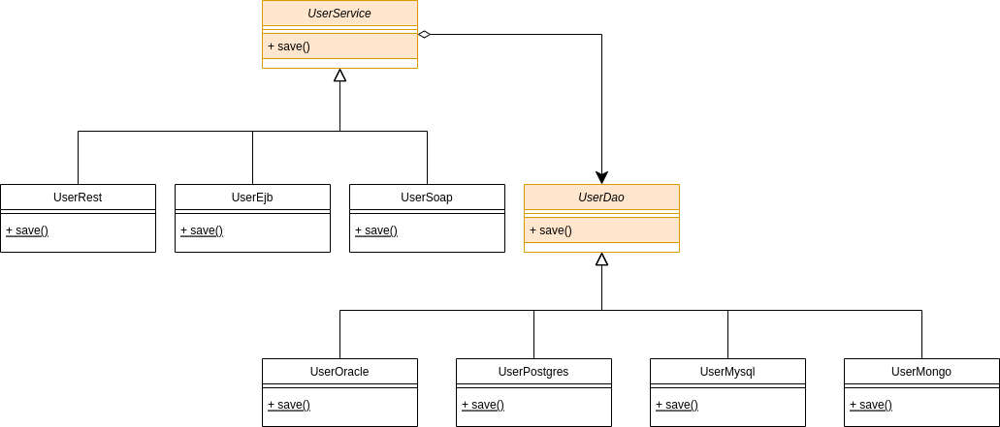

  <h3 align="center">Padrões de projeto estruturais</h3>

  

    Os padrões estruturais explicam como montar objetos e classes em estruturas maiores mas ainda mantendo essas estruturas flexíveis e eficientes.
  

<!-- TABLE OF CONTENTS -->

  
Índice

  <ol>
    <li>
      <a href="#Adapter">Adapter</a>
    </li>
    <li>
      <a href="#Bridge">Bridge</a>
    </li>
    <li>
      <a href="#Composite">Composite</a>
    </li>
    <li>
      <a href="#Decorator">Decorator</a>
    </li>
    <li>
      <a href="#Facade">Facade</a>
    </li>
    <li>
      <a href="#Flyweight">Flyweight</a>
    </li>
    <li>
      <a href="#Proxy">Proxy</a>
    </li>
  </ol>

# Adapter

O Adapter é um padrão de projeto estrutural que permite objetos com interfaces incompatíveis colaborarem entre si.

## Objetivo do projeto

- Apresentar o problema geral
- Apresentar uma solução utilizando o adapter
- Apresentar a diferença entre adapters de objeto e classe
- Apresentar como esse padrão está sendo utilizado em arquiteturas de sistemas modernos

## Problemas

- Como uma classe pode ser reusada mesmo que não tenha a interface requisitada pelo cliente?
- Como classes de interfaces incompatíveis podem trabalhar juntas?

## Solução

- Definir uma classe adapter que converta a interface de uma classe em outra que o cliente necessite

## GOF

> Converter a interface de uma classe em outra interface esperada pelos clientes. Adapter permite a comunicação entre classes que não poderiam trabalhar juntas devido à incompatibilidade de suas interfaces.

## Modelo Adapter HDMI

  

## Modelo Adapter Class HDMI

  

## Código

[Ver aqui](https://github.com/danielso2007/padroes_projetos_estruturais/tree/main/src/main/java/br/com/estruturais/adapter)

# Bridge

O Bridge é um padrão de projeto estrutural que permite que você divida uma classe grande ou um conjunto de classes intimamente ligadas em duas hierarquias separadas—abstração e implementação—que podem ser desenvolvidas independentemente umas das outras.

## Objetivo do projeto

- Apresentar o problema geral
- Apresentar uma solução utilizando o bridge
- Conhecer como este padrão pode ser utilizado juntamente com o padrão MVC
- Conhecer como este padrão pode ser utilizado juntamente com um exemplo simples de backend

## Problemas

- Como é possível fazer com que a abstração e a implementação possam variar independentemente?
- Como esta implementação pode variar em tempo de execução?

## Solução

- Definir um conjunto hierárquico para ambos os lados: abstração e implementação
- Em tempo de execução, será possível escolher a classe concreta para a abstração e para a implementação que são compatíveis graças às interfaces

## GOF

> Desacoplar uma abstração de sua implementação para que os dois possam variar independentemente

## Modelo Converter

  

## Modelo Services and Daos

  

## Código

[Ver aqui](https://github.com/danielso2007/padroes_projetos_estruturais/tree/main/src/main/java/br/com/estruturais/bridge)

# Composite

O Composite é um padrão de projeto estrutural que permite que você componha objetos em estruturas de árvores e então trabalhe com essas estruturas como se elas fossem objetos individuais.

## Objetivo do projeto

- Apresentar o problema geral
- Apresentar uma solução utilizando o composite
- Conhecer como a recursão ajuda bastante a nabegar por este padrão
- Ser apresentado para uma biblioteca que utiliza diversos padrões: swing

## Problemas

- Como seria possível criar uma estrutura onde uma unidade e um conjunto delas possam ser tratadas de forma transparente, sem diferenças?

## Solução

- Definir uma composição que possa comportar tanto um elemento apenas quando um conjunto desses mesmos elementos

## GOF

> Compor objetos em estrturas de árvore para representar hierarquias todo-parte. Composite permite que cliente tratem objetos individuais e composições de objetos de maneira uniforme

## Modelo File System

  

## Modelo Java Swing

  

## Código

[Ver aqui](https://github.com/danielso2007/padroes_projetos_estruturais/tree/main/src/main/java/br/com/estruturais/composite)

# Decorator

O Decorator é um padrão de projeto estrutural que permite que você acople novos comportamentos para objetos ao colocá-los dentro de invólucros de objetos que contém os comportamentos.

## Objetivo do projeto

- Apresentar o problema geral
- Apresentar uma solução utilizando o decorator
- Ver como o java swing utiliza este padrão

## Problemas

- Como posso adicionar funcionalidades dinamicamente em um objeto?

## Solução

- Com objetos decorators é possível adicionar novas responsabilidades para um objeto

## GOF

> Anexar responsabilidades adicionais a um obejto dinamicamente. Decorators oferecem uma alternativa flexível ao uso de herança para estender uma funcionalidade.

## Modelo Coffe Shop

  

## Modelo Java Swing

  

## Código

[Ver aqui](https://github.com/danielso2007/padroes_projetos_estruturais/tree/main/src/main/java/br/com/estruturais/decorator)

# Facade

O Facade é um padrão de projeto estrutural que fornece uma interface simplificada para uma biblioteca, um framework, ou qualquer conjunto complexo de classes.

## Objetivo do projeto

- Apresentar o problema geral
- Apresentar uma solução utilizando o facade
- Ver como podemos fazer variações dependendo do contexto

## Problemas

- Como posso simplificar o acesso a um sistema complexo utilizando uma interface simples?
- Como reduzir a complexidade interna de um sistema para o cliente?

## Solução

- Definir uma fachada que provisiona uma interface única para um conjunto de interfaces de um sistema

## GOF

> Oferecer uma interface única para um conjunto de interfaces de um subsistema. Façade define uma interface de nível mais elevado que torna o subsistema mais fácil de usar.

## Modelo Facade Before

  

## Modelo Facade After

  

## Modelo Facade Isolated

  

## Código

[Ver aqui](https://github.com/danielso2007/padroes_projetos_estruturais/tree/main/src/main/java/br/com/estruturais/facade)

# Flyweight

O Flyweight é um padrão de projeto estrutural que permite a você colocar mais objetos na quantidade de RAM disponível ao compartilhar partes comuns de estado entre os múltiplos objetos ao invés de manter todos os dados em cada objeto.

## Objetivo do projeto

- Apresentar o problema geral
- Apresentar uma solução utilizando o flyweight

## Problemas

- Como posso trabalhar com uma grande quantidade de objetos na memória de uma forma mais eficiente?

## Solução

- Dividir o objeto entre valores intrínsecos e extrínsecos
- Criar um flyweight que armazene os valores intrínsecos
- Os clientes irão compartilhar estes flyweights, adicionando os valores extrínsecos pontualmente

## GOF

> Usar compartilhamento para suportar grandes quantidades de objetos refinados eficientemente.

## Modelo Flyweight (Before) Music Player

  

## Modelo Flyweight (After) Music Player

  

## Modelo Flyweight Map Game

  

## Código

[Ver aqui](https://github.com/danielso2007/padroes_projetos_estruturais/tree/main/src/main/java/br/com/estruturais/flyweight)

# Proxy

O Proxy é um padrão de projeto estrutural que permite que você forneça um substituto ou um espaço reservado para outro objeto. Um proxy controla o acesso ao objeto original, permitindo que você faça algo ou antes ou depois do pedido chegar ao objeto original.

## Objetivo do projeto

- Apresentar o problema geral
- Apresentar uma solução utilizando o proxy
- Conhecer os tipos de proxy existentes

## Problemas

- Como posso controlar o acesso a alguns objetos?
- Como posso adicionar funcionalidades durante o acesso a algum objeto?

## Solução

- Utilizar uma estrutura de proxy para atuar como se fosse um outro objeto
- Utilizando o proxy como forma de acessar o obejto real, será possível controlar o seu acesso

## GOF

> Prover um substituto ao ponto através do qual um objeto possa controlar o acesso a outro.

## Modelo Proxy ATM

  

## Modelo Proxy Heavy Resource

  

## Código

[Ver aqui](https://github.com/danielso2007/padroes_projetos_estruturais/tree/main/src/main/java/br/com/estruturais/proxy)
